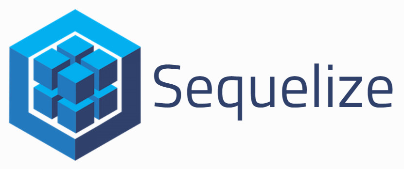

# Hallowgram

An fullstack application created by [Michael Haviv](https://github.com/mhaviv) and [Jeiner Noriega](https://github.com/bigal2331). A Halloween themed Instagram clone application

## Getting Started

```bash
$ git clone https://github.com/Hallowgram/Hallowgram-App
$ cd Hallowgram-App
$ npm install
$ node app.js
```

## Deployment

[hallowgram.herokuapp.com](hallowgram.herokuapp.com)


## Technology Used

 <br><br>
* [Amazon S3](https://aws.amazon.com/s3/) is object storage built to store and retrieve any amount of data from anywhere.
<br><br>

 <br><br>
* [EJS](http://ejs.co/) is a simple templating language that lets you generate HTML markup with plain JavaScript.
<br><br>

 <br><br>
* [Express](https://expressjs.com/) is a minimal and flexible Node.js web application framework that provides a robust set of features for web and mobile applications.
<br><br>

<hr>

<br>
* [Multer](https://www.npmjs.com/package/multer) is a node.js middleware for handling multipart/form-data, which is primarily used for uploading files.
<br><br>

<hr>

 <br><br>
* [Node](https://nodejs.org/en/) is a multi-platform, open-source JavaScript run-time environment that executes code on the server-side.
<br><br>

 <br><br>
* [PostgreSQL](https://www.postgresql.org/) is a powerful, open source object-relational database system.
<br><br>

 <br><br>
* [PostgreSQL](http://docs.sequelizejs.com/) is a promise-based ORM for Node.js v4 and up. It supports the dialects PostgreSQL, MySQL, SQLite and MSSQL and features solid transaction support, relations, read replication and more.
<br><br>

## Contribute
* Contributions are always welcome! Please read the [contribution guidelines](CONTRIBUTING.md) first.

## Credits

Michael Haviv (contributor)
Jeiner Noriega (contributor)
